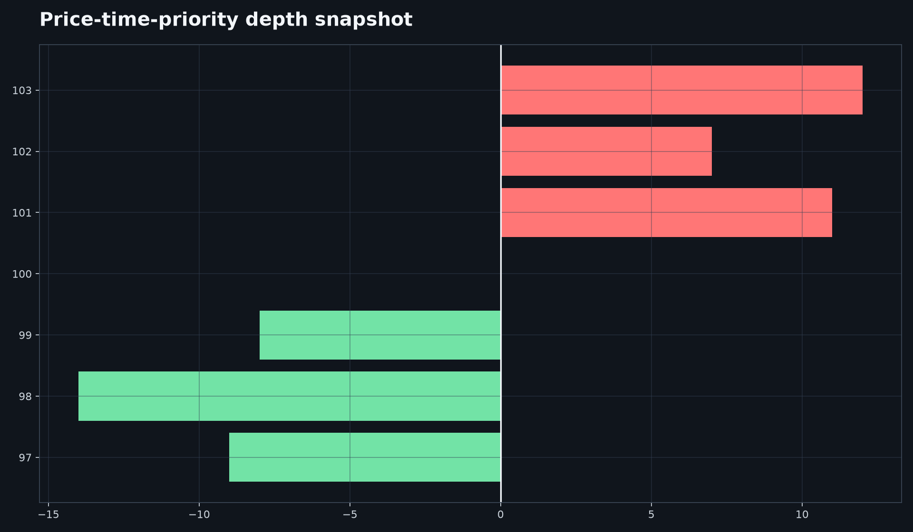

# Limit Order Book Simulator



A deterministic price-time-priority matching engine with a Flask API and an optional real Alpaca IEX top-quote endpoint.

```bash
pip install -e . pytest ruff
lob-simulator
```

In another terminal:

```bash
curl -X POST http://localhost:8000/orders -H "Content-Type: application/json" -d '{"side":"buy","quantity":10,"price":100}'
curl http://localhost:8000/market/AAPL
pytest && ruff check . && ruff format --check .
```

To use Alpaca, create an ignored local `.env` with `MARKET_DATA_PROVIDER=alpaca`, `ALPACA_API_KEY=`, `ALPACA_SECRET_KEY=`, and `ALPACA_FEED=iex`. Without keys, `/market/<ticker>` uses the yfinance latest minute close. The in-memory API is a simulator: `/book` is not Level 2 exchange depth, even when `/market` is live. Market orders only consume available simulated liquidity and never rest.

This project is intended for educational and research purposes only. It does not provide investment advice, and its outputs should not be used as the sole basis for financial decisions. Historical performance and simulated results do not guarantee future performance.

MIT License. Author: Aarav Shah.
